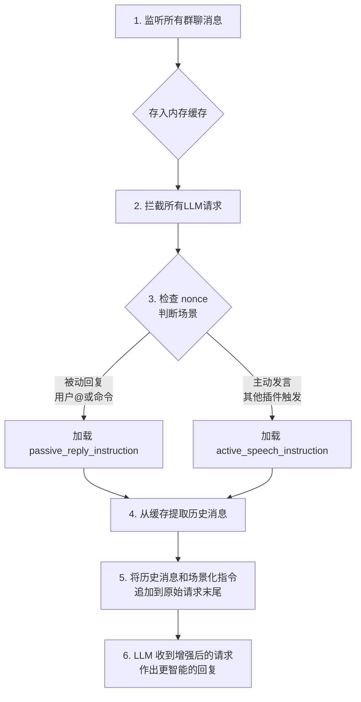

# AstrBot 上下文增强器 (Context Enhancer)

一个为 AstrBot 设计的智能上下文增强插件，它能让您的机器人在群聊中“知晓前文，见机行事”，实现真正意义上的流畅对话。

## 核心功能

为所有 LLM 调用自动注入丰富的对话历史与场景化指令，极大提升机器人在群聊环境下的智能表现与交互体验。

## ✨ 功能亮点

-   **🤖 智能场景感知**：插件通过 `nonce` 机制精确区分两种核心场景：
    -   **被动回复**：当用户通过 `@机器人` 或命令直接触发时。
    -   **主动发言**：当机器人由其他插件（如 `wakepro`）唤醒，需要主动参与讨论时。
    -   针对不同场景，插件会应用不同的对话策略，让机器人的回应更贴切、更自然。

-   **🧠 通用上下文增强**：无论 LLM 请求来自哪个插件或哪个触发方式，只要发生在已启用的群组中，本插件都会自动为其注入历史聊天记录，确保机器人总能基于完整的上下文进行思考。

-   **🔧 可配置的对话策略**：您可以通过 `passive_reply_instruction` 和 `active_speech_instruction` 这两个强大的配置项，像导演一样精确指导机器人在不同场景下的行为模式和语气。

-   **🖼️ 图片理解能力**：插件能够将对话历史中的图片转换为文字描述（需要具备图像分析能力的 LLM），并将其一并纳入上下文，让机器人也能“看懂”图片，理解图文并茂的讨论。

-   **🚀 健壮与高效**：内置网络请求重试、并发安全锁（`asyncio.Lock`）以及高效的内存缓存与自动清理机制，确保插件在高负载下也能稳定、高效地运行。

## ⚙️ 工作流程

插件通过拦截和增强 LLM 请求，为机器人赋予强大的上下文理解能力。其工作流程如下：

## 🛠️ 配置项说明

插件首次加载后，会在 `data/plugins/astrbot_plugin_context_enhancer/` 目录下生成 `config.json` 文件。您可以根据需要进行修改。

| 配置项名称                      | 功能描述                                                                                             | 默认值                                                                                                     |
| ------------------------------- | ---------------------------------------------------------------------------------------------------- | ---------------------------------------------------------------------------------------------------------- |
| `enabled_groups`                | 启用插件的群组ID列表。空列表 `[]` 表示对所有群组生效。                                               | `[]`                                                                                                       |
| `recent_chats_count`            | 构建上下文时，最多包含的最近聊天记录数量。                                                           | `15`                                                                                                       |
| `bot_replies_count`             | 在上下文中，最多包含多少条机器人自身的历史回复。                                                     | `5`                                                                                                        |
| `collect_bot_replies`           | 是否收集机器人自身的回复以构建更完整的对话历史。                                                     | `true`                                                                                                     |
| **`passive_reply_instruction`** | **核心指令**：当用户 `@` 或使用命令时，附加在上下文末尾的指令模板。指导机器人如何进行被动回复。      | `"现在，群成员 {sender_name} ... 正在对你说话 ... 你需要...直接回复该用户。"`                               |
| **`active_speech_instruction`** | **核心指令**：当机器人决定主动发言时，附加在上下文末尾的指令模板。指导机器人如何自然地切入对话。     | `"以上是最近的聊天记录。现在，你决定主动参与讨论 ... 你需要...自然地切入对话。"`                             |
| `enable_image_caption`          | 是否为对话中的图片生成文字描述。需要配置具备图像分析能力的 LLM。                                     | `true`                                                                                                     |
| `image_caption_provider_id`     | 用于图片描述的专用 LLM 提供商 ID。为空则使用主提供商。                                               | `""`                                                                                                       |
| `image_caption_prompt`          | 生成图片描述时使用的提示词模板。                                                                     | `"请简洁地描述这张图片的主要内容..."`                                                                      |
| `max_context_images`            | 一次 LLM 请求的上下文中最多包含的图片数量。                                                          | `4`                                                                                                        |
| `inactive_cleanup_days`         | 群组连续N天无消息后，自动清理其上下文缓存以释放内存。                                                | `7`                                                                                                        |
| `cleanup_interval_seconds`      | 每隔多少秒检查一次是否有不活跃的群组缓存需要清理。                                                   | `600`                                                                                                      |
| `command_prefixes`              | 哪些消息前缀会被视为触发 LLM 回复的命令。                                                            | `["/", "!", "！", "#", ".", "。"]`                                                                          |
| `duplicate_check_window_messages` | 在判断新消息是否为重复时，向前追溯检查的消息条数。                                                   | `5`                                                                                                        |
| `duplicate_check_time_seconds`  | 在判断新消息是否为重复时，两条消息的时间戳在此秒数内才被视为可能重复。                               | `30`                                                                                                       |

## 许可证

本项目采用 MIT 许可证。
